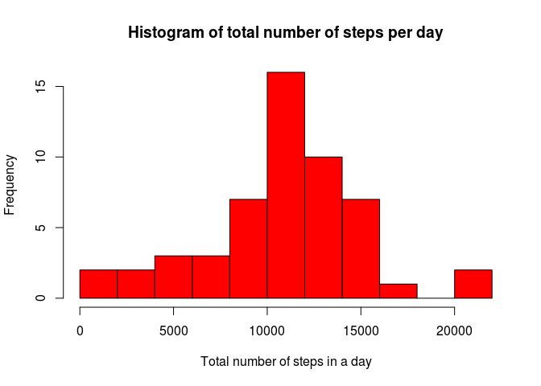
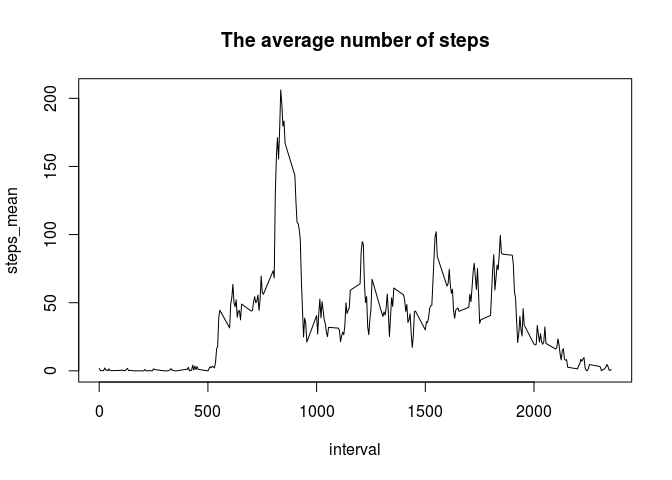
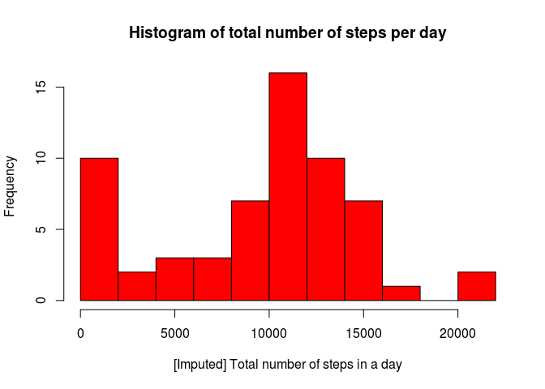
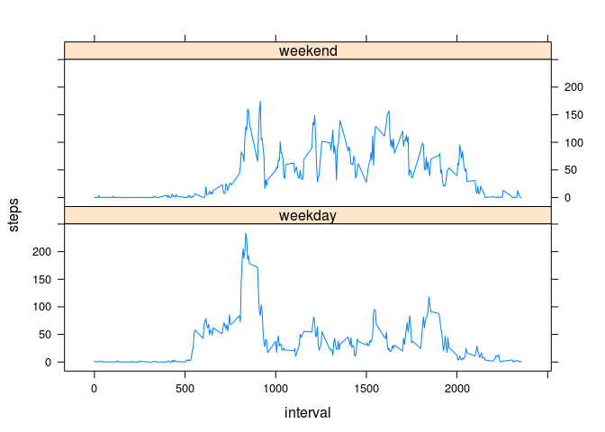

# Reproducible Research: Peer Assessment 1

## Student Information

```r
#Name  :Sagar Pathak
#Email : surfer.sagar@gmail.com
#Date  : 2015-12-18 
#Desc  : Reproducible Research: Peer Assessment 1
```

## Loading and preprocessing the data
Load the activity data

```r
#extract the activity.zip file and put it into working directory
#setwd("/home/sagar/Documents/Coursera/Data Science/Reproducible Research")
df <- read.csv("activity.csv", header=TRUE);
#df <- na.omit(df);
tail(df, n=3);
```

```
##       steps       date interval
## 17566    NA 2012-11-30     2345
## 17567    NA 2012-11-30     2350
## 17568    NA 2012-11-30     2355
```

```r
df$date <- as.Date(df$date, "%Y-%m-%d")
```


## What is mean total number of steps taken per day?

Calculate the total number of steps taken per day
Make a histogram of the total number of steps taken each day

The total number of steps taken per day was calculated by using aggregate function.

```r
stepsDay_totals <- aggregate(steps ~ date, data = df, FUN=sum, na.rm=TRUE)
names(stepsDay_totals) <- c("date", "total_steps")
```
Histogram

```r
hist(stepsDay_totals$total_steps, breaks=10, col="red", main="Histogram of total number of steps per day", xlab="Total number of steps in a day")
```

 

Calculate and report the mean and median of the total number of steps taken per day


```r
mean(stepsDay_totals$total_steps)
```

```
## [1] 10766.19
```
Median 

```r
median(stepsDay_totals$total_steps)
```

```
## [1] 10765
```
## What is the average daily activity pattern?
Make a time series plot (i.e. type = "l") of the 5-minute interval (x-axis) and the average number of steps taken, averaged across all days (y-axis)


```r
stepsInterval_mean <- aggregate(steps ~ interval, data = df, FUN=mean, na.rm=TRUE)
names(stepsInterval_mean) <- c("interval", "steps_mean")
plot(stepsInterval_mean, type = "l", main="The average number of steps")
```

 

Which 5-minute interval, on average across all the days in the dataset, contains the maximum number of steps?

```r
max_interval <- which.max(stepsInterval_mean$steps_mean)
stepsInterval_mean$interval[max_interval]
```

```
## [1] 835
```


## Imputing missing values

The total number of rows with missing values in the dataset

```r
missing_values <- sum(is.na(df))
missing_values  
```

```
## [1] 2304
```
Missing values will be replaced by mean for that day. If the mean is NA, missing values will be replaced by 0.


```r
nas_vector <- is.na(df$steps)
stepsDay_mean <- aggregate(steps ~ date, data = df, FUN=mean, na.rm=FALSE)
names(stepsDay_mean) <- c("date", "steps_mean")

#copy data frame df
imputed_df <- df
head(imputed_df)
```

```
##   steps       date interval
## 1    NA 2012-10-01        0
## 2    NA 2012-10-01        5
## 3    NA 2012-10-01       10
## 4    NA 2012-10-01       15
## 5    NA 2012-10-01       20
## 6    NA 2012-10-01       25
```

Loop

```r
#loop
for (i in 1:nrow(imputed_df)){
  if (nas_vector[i]==TRUE){
    date <- imputed_df$date[i]
    date <- as.Date(date, "%Y-%m-%d")
    if (is.na(stepsDay_mean$steps_mean[date])){
      imputed_df$steps[i] <- 0
    }
    else {
      imputed_df$steps[i] <- stepsDay_mean$steps_mean[date]
    }
  }
}
head(imputed_df)
```

```
##   steps       date interval
## 1     0 2012-10-01        0
## 2     0 2012-10-01        5
## 3     0 2012-10-01       10
## 4     0 2012-10-01       15
## 5     0 2012-10-01       20
## 6     0 2012-10-01       25
```

Complete cases checks

```r
sum(complete.cases(df))
```

```
## [1] 15264
```

```r
sum(complete.cases(imputed_df))
```

```
## [1] 17568
```

Make a histogram of the total number of steps taken each day and Calculate and report the mean and median total number of steps taken per day. Do these values differ from the estimates from the first part of the assignment? What is the impact of imputing missing data on the estimates of the total daily number of steps?

New dataset needs to be aggregated by date

```r
step_tot <- aggregate(steps ~ date, data = imputed_df, FUN=sum, na.rm=TRUE)
names(step_tot) <- c("date", "total_steps")
head(step_tot)
```

```
##         date total_steps
## 1 2012-10-01           0
## 2 2012-10-02         126
## 3 2012-10-03       11352
## 4 2012-10-04       12116
## 5 2012-10-05       13294
## 6 2012-10-06       15420
```

```r
hist(step_tot$total_steps, breaks=10, col="red", main="Histogram of total number of steps per day", xlab="[Imputed] Total number of steps in a day")
```

 

New mean and median are calculated. Missing values have got the impact on those parameters.

```r
mean(step_tot$total_steps)
```

```
## [1] 9354.23
```
Median 

```r
median(step_tot$total_steps)
```

```
## [1] 10395
```

## Are there differences in activity patterns between weekdays and weekends?
This calculation will be carried for the original data.

```r
#two new columns weekday and day_type are added to df, by default day_type is weekday for all weekdays
df$day <- weekdays(df$date)
df$day_type <- c("weekday")

#loop to assign weekends
for (i in 1:nrow(df)){
    if (df$day[i] == "Saturday" || df$day[i] == "Sunday"){
      df$day_type[i] <- "weekend"
    }
}

stepsInt <- aggregate(steps ~ interval + day_type, data=df, FUN=mean)
names(stepsInt) <- c("interval", "day_type", "steps")

library(lattice)
xyplot(steps ~ interval | day_type, stepsInt, type = "l", layout = c(1, 2))
```

 
